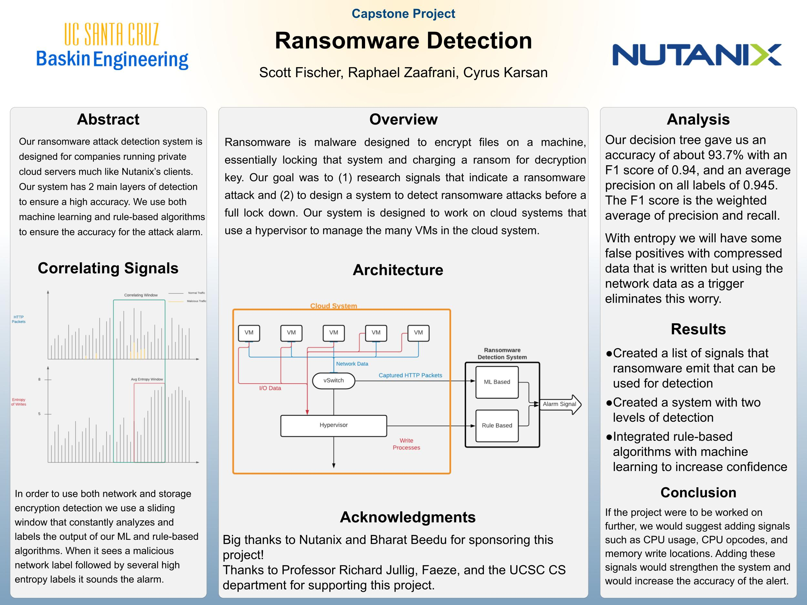

# Ransomware Detection
Ransomware detection detects ransomware in virtual machines. This program is designed to be installed on a hypervisor to monitor cluster of VM's. 

## Features

## Installation
### Prequisites
You must have Python 3.8+ installed.

### Requirements
`pip3 install -r requirements.txt`

## Usage

## Demo/ Resources

https://csspp.soe.ucsc.edu/2021nutanix

Add video here. Maybe host on Youtube?
## Technologies Used
Written only in Python. 

## Team
This project was done in conjuction with Nutanix and was our senior capstone project at UC Santa Cruz.\
[Cyrus Karsan](https://cyruskarsan.github.io)\
Scott Fischer\
Raphael Zaafrani